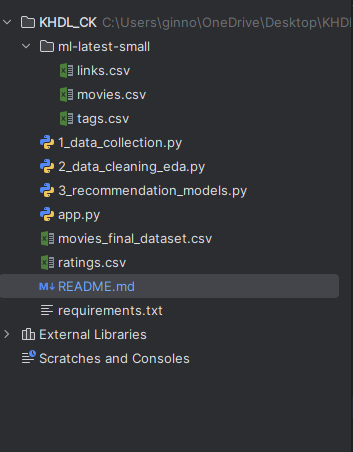

# 🎬 FINAL PROJECT: HYBRID MOVIE RECOMMENDATION SYSTEM

> **Họ và tên:** [Nguyễn Thế Bình]  
> **Mã sinh viên:** [B22DCCN083]  
> **Môn học:** Khoa học Dữ liệu (Data Science)  
> **Link Demo:** https://thbn1208.streamlit.app/

---

## 📌 I. Tổng quan dự án (Project Overview)

Dự án xây dựng một hệ thống gợi ý phim (Movie Recommendation System) thông minh, kết hợp giữa **Content-Based Filtering** (Lọc theo nội dung) và **Collaborative Filtering** (Lọc cộng tác). 

Hệ thống giải quyết bài toán "Overload Information" (quá tải thông tin) bằng cách giúp người dùng tìm ra những bộ phim phù hợp nhất dựa trên sở thích cá nhân hoặc xu hướng cộng đồng.

### Điểm nổi bật:
* **Dữ liệu lai (Enriched Data):** Kết hợp dữ liệu chuẩn từ MovieLens với dữ liệu hình ảnh/nội dung thời gian thực từ TMDB API.
* **Mô hình Hybrid:** Tích hợp 2 thuật toán gợi ý để tối ưu hóa kết quả.
* **Giao diện trực quan:** Web App tương tác mượt mà, hiển thị Poster phim và thông tin chi tiết.

---

## 🛠 II. Công nghệ sử dụng (Tech Stack)

* **Ngôn ngữ:** Python
* **Thu thập & Xử lý dữ liệu:** Pandas, Numpy, Requests (API).
* **Trực quan hóa (EDA):** Matplotlib, Seaborn.
* **Machine Learning:** Scikit-learn (TfidfVectorizer, TruncatedSVD, Cosine Similarity).
* **Web Framework:** Streamlit.
* **Deployment:** Streamlit Community Cloud.

---

## 📊 III. Quy trình thực hiện (Workflow)

### 1. Thu thập & Làm giàu dữ liệu (Data Collection)
* **Nguồn dữ liệu gốc:** Bộ dữ liệu `MovieLens Latest Small` (gồm 100,000 ratings và 9,000 phim).
* **Kỹ thuật thu thập:** Sử dụng `tmdbId` từ MovieLens để gọi API sang **The Movie Database (TMDB)**.
* **Kết quả:** Thu thập thêm được `poster_path` (ảnh bìa), `overview` (tóm tắt phim) và `vote_count` để phục vụ hiển thị và xử lý ngôn ngữ tự nhiên (NLP).

### 2. Tiền xử lý & EDA (Preprocessing & EDA)
* **Làm sạch:** Xử lý Missing Values, loại bỏ các phim trùng lặp, lọc bỏ các phim có quá ít lượt bình chọn (tránh nhiễu).
* **Trực quan hóa:**
    * Phân tích phân bố điểm đánh giá (Rating Distribution).
    * Thống kê Top phim phổ biến.
    * Phân tích tần suất thể loại phim.
* **Feature Engineering:** Chuyển đổi văn bản tóm tắt phim (`overview`) thành vector số học sử dụng kỹ thuật **TF-IDF**.

### 3. Xây dựng Mô hình (Modeling)

#### A. Model 1: Content-Based Filtering
* **Cơ chế:** Gợi ý dựa trên sự tương đồng về nội dung (cốt truyện) giữa các bộ phim.
* **Kỹ thuật:** Sử dụng `TfidfVectorizer` để vector hóa văn bản và tính `Cosine Similarity` (độ tương đồng cosin).
* **Ưu điểm:** Giải quyết vấn đề "Cold Start" cho các phim mới, gợi ý chính xác các phim cùng series hoặc cùng chủ đề.

#### B. Model 2: Collaborative Filtering
* **Cơ chế:** Gợi ý dựa trên hành vi đánh giá của cộng đồng (Users).
* **Kỹ thuật:** Sử dụng **Matrix Factorization** (Phân rã ma trận) với thuật toán `TruncatedSVD` (Singular Value Decomposition).
* **Ưu điểm:** Khám phá được các sở thích tiềm ẩn (Latent Features) của người dùng mà nội dung văn bản không thể hiện được.

### 4. Đóng gói & Triển khai (Deployment)
* Xây dựng giao diện người dùng với **Streamlit**.
* Hiển thị kết quả dạng lưới (Grid Layout) với Poster phim bắt mắt.
* Deploy ứng dụng lên **Streamlit Cloud** để truy cập online.

---

## 📂 IV. Cấu trúc thư mục (Project Structure)

---

## 🚀 V. Hướng dẫn cài đặt (Installation)

Để chạy dự án trên máy cục bộ (Localhost), hãy làm theo các bước sau:

**Bước 1: Clone dự án về máy**
git clone [LINK_GITHUB_CUA_BAN]
cd Movie-Recommender-System

**Bước 2: Cài đặt thưu viện**
pip install -r requirements.txt

**Bước 3: Chạy ứng dụng**
streamlit run app.py

## 📈 VI. Kết quả đạt được & Hướng phát triển
Kết quả: Hệ thống hoạt động ổn định, gợi ý nhanh (thời gian phản hồi < 1s), giao diện thân thiện.

Hướng phát triển (Future Work):

Tích hợp tính năng đăng nhập User để lưu lịch sử xem phim.

Sử dụng Deep Learning (Neural Collaborative Filtering) để tăng độ chính xác.

Cải thiện tốc độ tải trang bằng cách caching dữ liệu hiệu quả hơn.

Cảm ơn Thầy và các bạn đã quan tâm theo dõi dự án!